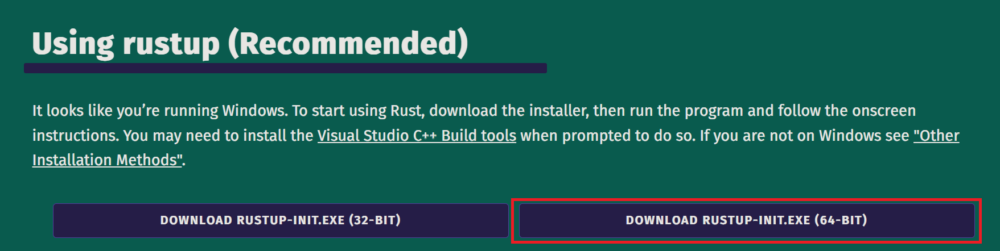
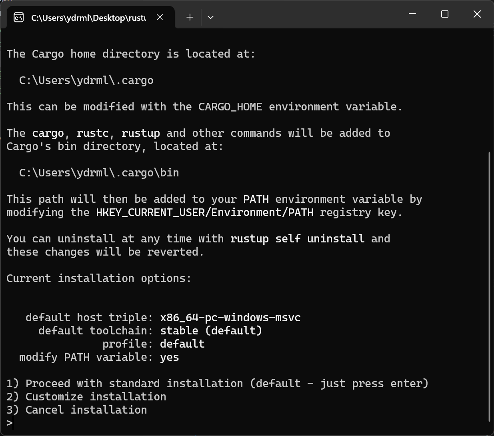

# windows 下的 Rust 环境

## 本节目录

- [windows 下的 Rust 环境](#windows-下的-rust-环境)
  - [本节目录](#本节目录)
  - [参考教程](#参考教程)
  - [VS Code 插件](#vs-code-插件)
  - [特殊说明](#特殊说明)
  - [WSL 支持](#wsl-支持)

## 参考教程

请按照[Windows 下 Rust 开发环境搭建](https://learn.microsoft.com/zh-cn/windows/dev-environment/rust/setup#install-visual-studio-recommended-or-the-microsoft-c-build-tools)进行配置，官方文档上写的很详细。

> **NOTICE** Windows 用户推荐采用原生 Windows 环境开发 Rust 项目。

> **NOTICE** Rust 工具链依赖 Visual Studio 作为基础，下述简单步骤假设用户已经准备好 Visual Studio 或 Microsoft C++ 生成工具。

如图所示，下载并运行安装程序。



Just press enter!



## VS Code 插件

在 Windows 下，比较推荐使用 VS Code 进行 Rust 开发，如果我没记错，在 VS-Code 里面直接装“rust-anaylzer”这个插件就行了，不用做其它麻烦的操作。

## 特殊说明

在下载 rust 工具时，**注意 rustc 版本号，至少 rust version 1.79.0 (129f3b996 2024-06-10)**。

## WSL 支持

> **NOTICE** 仅针对已有配置好的 WSL2 且不方便在原生 Windows 环境开发的情况，因此配置 WSL2 的步骤不再介绍。

> **NOTICE** Windows 用户首选原生 Windows 环境，其次 WSL2，**不推荐**使用第三方虚拟机软件。

> 第三方虚拟机软件(如 VMware)在使用 GPU 加速项目的运行时，免费版的疑似完全不支持 GPU 映射，这导致你的计算机内明明有 GPU，但在虚拟机中看不到 GPU，只能使用 CPU 进行计算，这会导致你的项目在模型参数量较大时，运行速度非常慢，因此不推荐使用。

在 WSL2 Bash 中使用此命令安装 Rust（Just press enter!）：

```bash
curl --proto '=https' --tlsv1.2 -sSf https://sh.rustup.rs | sh
```
