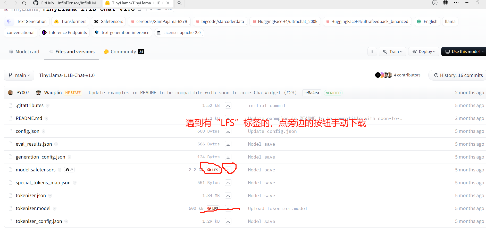

# 拉取仓库 & 示例模型下载

**注：运行过程中产生的问题请查阅[Q & A](./problem.md)，实在解决不了，再在微信群聊中咨询助教和老师！**

## 本节目录

- [拉取仓库 \& 示例模型下载](#拉取仓库--示例模型下载)
  - [本节目录](#本节目录)
  - [1. 拉取引擎仓库](#1-拉取引擎仓库)
  - [2. 下载模型](#2-下载模型)
    - [下载命令](#下载命令)
    - [参数解释：](#参数解释)
    - [手动下载方式：](#手动下载方式)
  - [完成标志](#完成标志)

## 1. 拉取引擎仓库

```bash
git clone https://github.com/InfiniTensor/InfiniLM
```

注：有时候网络质量不好导致拉取超时，则可以尝试等网络质量好的时候再下载！

此步骤结束后，应该如下所示：

```bash
$ ls
$ InfiniLM
```

## 2. 下载模型

### 下载命令

注：此部分以“TinyLlama-1.1B-Chat-v1.0”模型为例，此模型的源下载网站为：“ https://huggingface.co/TinyLlama/TinyLlama-1.1B-Chat-v1.0 ”（需要魔法），建议使用 “ https://hf-mirror.com/TinyLlama/TinyLlama-1.1B-Chat-v1.0 ”的镜像，下面以从镜像网站下载为例：

输入命令：

```bash
GIT_LFS_SKIP_SMUDGE=1 git clone https://hf-mirror.com/TinyLlama/TinyLlama-1.1B-Chat-v1.0
```

### 参数解释：

`GIT_LFS_SKIP_SMUDGE=1`：跳过 LFS 的 smudge 操作，即跳过 LFS 的文件预处理操作。

因为模型中，有一个“模型参数”文件，其占用磁盘较大，示例占了 2.2G，导致 git 拉取时，极其容易超时，所以使用此参数跳过此文件，之后我们手动对需要用 LFS 下载的文件进行下载。

### 手动下载方式：

在镜像网站上，点击下面框起来的内容：


注：手动下载的两个文件，一定要放置到刚刚用 git 下载的目录里！

## 完成标志

在某一文件夹内，存放有拉取到的模型：

```bash
./TinyLlama-1.1B-Chat-v1.0/
|
|-- README.md
|-- eval_results.json
|-- model.safetensors
|-- tokenizer.json
|-- tokenizer_config.json
|-- config.json
|-- generation_config.json
|-- special_tokens_map.json
|-- tokenizer.model
```
