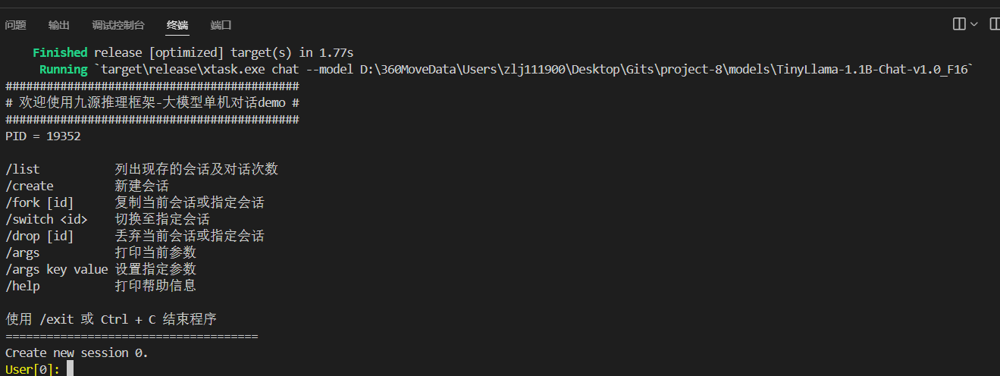

# 编译模型 & 运行

## 本节目录

- [编译模型 \& 运行](#编译模型--运行)
  - [本节目录](#本节目录)
  - [目录路径展示](#目录路径展示)
  - [精度转化](#精度转化)
  - [完成标志](#完成标志)
  - [运行](#运行)

## 目录路径展示

此部分为展示我的目录路径，不需要读者做相同操作，只是方便读者阅读使用。

```python
D:/project-8/
|-- InfiniLM
    |-- # 此部分就是引擎仓库，具体内容除Cargo.toml，略
    |-- Cargo.toml
    |-- ...
|-- models
    |-- # 此部分是模型文件夹，我用它来存放所有的模型
    |-- TinyLlama-1.1B-Chat-v1.0
        |-- # 此部分就是刚刚下载的模型，里面必须至少有以下3种文件：
        |-- config.json                 # 模型配置文件
        |-- model.safetesnors           # 模型参数文件
        |-- tokenizer.model/vocab.txt   # 分词器词表
        |-- ...
    |-- TinyLlama-1.1B-Chat-v1.0_F16
        |-- # 此部分最开始没有，在我们“精度转化”操作后，得到此文件夹
        |-- ...
```

## 精度转化

```bash
cd InfiniLM # 切换至InfiniLM目录内
# 然后参照官方文档
# 我们直接编译刚刚下载的模型，要先转化精度为f16
# 我的目录路径如上所示，请自行修改下面参数：
cargo cast --model D:/project-8/models/TinyLlama-1.1B-Chat-v1.0/ --dt f16
# 然后，就会在 D:/project-8/models/ 文件夹内生成一个 TinyLlama-1.1B-Chat-v1.0_F16 文件夹
```

## 完成标志

你的目录结构，应该与上面展示的目录结构类似。

## 运行

```bash
cd InfiniLM # 切换至InfiniLM目录内
# 然后参照官方文档，即可完成
cargo chat --model D:/project-8/models/TinyLlama-1.1B-Chat-v1.0_F16
```

展示输出：

