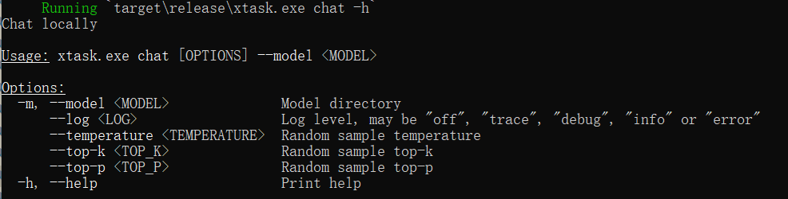
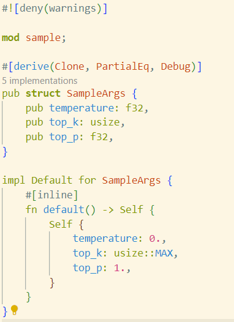

# 其它服务

**注：运行过程中产生的问题请查阅[Q & A](./problem.md)，实在解决不了，再在微信群聊中咨询助教和老师！**

## 本节目录

- [其它服务](#其它服务)
  - [本节目录](#本节目录)
  - [获取帮助](#获取帮助)
  - [参数介绍](#参数介绍)
  - [具体说明](#具体说明)

## 获取帮助

在命令行窗口下，通过：

```bash
cargo chat --help
# 或者
cargo chat -h
```

可以查看 `chat` 可用的命令。

而这个 InfiniLM，提供了 `chat` 模式、 `generate` 模式和 `service` 模式。其中， `chat` 模式，就是上面展示的对话模式； `generate` 模式，就是生成文本的模式； `service` 模式，就是提供 HTTP 服务，供其它应用调用的模式。

你可以通过分别指定模式，输入：

```bash
cargo generate -h
# 或者
cargo service -h
```

来查看 `generate` 模式和 `service` 模式的参数使用方法。

## 参数介绍

通过 `-h` 或 `--help` ，可以得到可用参数列表：



- `--model` 指定模型名称，要精度转换后的名称，例：`D:/project-8/models/TinyLlama-1.1B-Chat-v1.0_F16`。此命令可以用 `-m` 代替。
- `--log` 指定日志的模式，支持`debug`、`info`、`warn`、`error`、`off`。
- `--temperature` 指定生成文本时的温度值，控制生成文本的随机性，值越高生成的文本随机性越大。
- `--top_p` 指定生成文本时的 Top-P 值，控制生成文本的最小概率阈值，值越高生成的文本多样性越低。
- `--top_k` 指定生成文本时的 Top-K 值，控制生成文本时考虑的前 K 个词的数量，值越高生成的文本多样性越高。



## 具体说明

大模型是建立在“随机加权”这一机制下的，其大致的工作原理是，在生成文本(即进行回答)时，会根据模型训练出来的权重，随机选择下一个词，而权重越高，选择的概率越大。

在实施词汇选择的过程中，模型首先筛选出一个“备选词集”，然后从这个集合中选定一个词汇作为输出。top_k 就是决定这批“备选词”的数量的参数。

对于 temperature 参数，其较难解释，可以简单的理解为“偏移量”，当在备选词集合中挑选词汇时，朴素的想法是，直接挑选概率最高的词，但这会导致，只要你的提问不变，那么每次生成的文本就都完全一样，因此，引入 temperature 参数，使得在备选词集合中，概率最高的词，被选中的概率降低，而其它词被选中的概率增加，从而使得生成的文本更加随机。

对于 top_p 参数，它根据概率分布的累积概率来选择候选词汇。具体来说，模型会根据每个词汇的概率进行排序，然后选择累积概率达到 top_p 值的那部分词汇作为候选集。例如，如果 top_p 设置为 0.9，那么模型会选出概率最高的词汇，直到它们的累积概率达到 0.9。在候选集中，每个词汇最终被选中的概率是相等的。top_p 的推荐取值范围通常在[0.5, 1.0]之间，这个值决定了采样的范围，值越低，采样的词汇越多，文本的多样性越高，值越高，概率加和后高于此值的、最终可能能够被采样的词汇就越多，文本的多样性越高。
