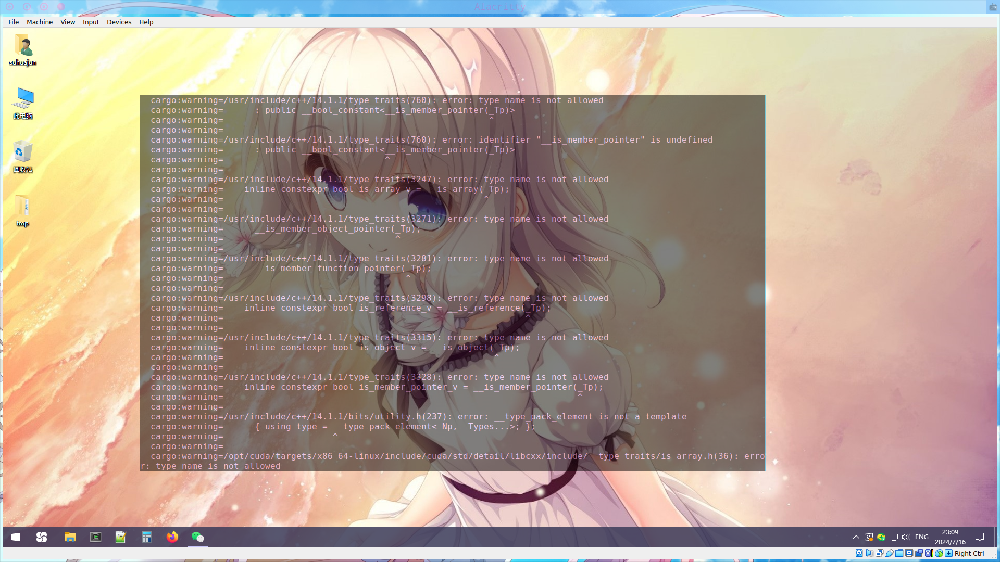

# Q & A

1. 除了 cpp 和 Rust 还需要什么专业基础嘛？

   > 材料还在整理和补充，会陆续放出

2. 直播有回放吗？

   > 有的，每个阶段中的学习视频栏目中将可见每次课程直播回放
   >
   > - 样例可见导学中关于 OS 训练营大模型引擎项目课程：[https://opencamp.cn/os2edu/camp/2024spring/stage/10?tab=video](https://opencamp.cn/os2edu/camp/2024spring/stage/10?tab=video)

3. C++ 或者 Rust 对后续专业阶段和项目阶段有什么影响吗，比如某一方向要求是 Rust

   > AI 编译器是 cpp 做的，大模型推理是 Rust 做的。我们鼓励学员们选择多个方向，难度都不是特别大，专业阶段中不同方向的上课时间也不同，不用担心上课时间冲突

4. 关于 InfiniTensor 拉取

   > 这个项目通过 http 进行拉取会出现没有权限的问题，需配置 Github ssh 密钥来通过 ssh 进行克隆到本地操作：
   > **第一步：检查本地主机是否已经存在 ssh key**
   >
   > ```shell
   > cd ~/.ssh
   > ls
   > # 查看是否已存在id_rsa和id_rsa.pub文件
   > # Windows系统则查看C:\Users\<Your Username>\.ssh文件夹下
   > # 存在可直接看第三步
   > ```
   >
   > **第二步：生成 ssh key**
   >
   > ```shell
   > ssh-keygen -t rsa -C "xxx@xxx.com"
   > # 一直回车即可
   > # Windows系统下同理，不想要后面一串也可以直接运行ssh-keygen指令
   > ```
   >
   > **第三步：获取 ssh key 公钥内容并添加到 Github**
   >
   > 复制 `id_rsa.pub`文件内的内容，之后 Github 右上角点击头像->Settings->SSH and GPG keys->右上角蓝色 New SSH key 按钮->将复制的内容粘贴到 Key 输入框中添加 title 以便管理->最后点击 Add SSH key 即可
   > 验证是否配置 ssh 公钥成功可运行 `ssh -T git@github.com`指令，看见输出 `Hi xxx! You've successfully authenticated, ...`即可
   > 之后即可运行 `git clone git@github.com:InfiniTensor/InfiniTensor.git`克隆 InfiniTensor 到本地

5. InfiniLM 支持问题

   > 目前 InfiniLM 只支持 Llama。对于中文输入，一个方面是使用模型的中文能力问题，另外采样中有些技巧可以控制输出的长度和风格目前并未实现于 InfiniLM，设置一下采样参数会好些

6. 关于导学阶段安排

   > 目前导学阶段直接在[社区网站](https://opencamp.cn/InfiniTensor/camp/2024summer/stage/0)阅览学习即可，以及尝试导学实践内容 -- 部署运行 InfiniLM 到本地，以及 exam-gradings 的部署与应用

7. 关于后续基础阶段内容问题

   > 后续基础阶段分为 C++基础和 Rust 基础，目前导学阶段若没有 Rust 基础建议可以尝试学习，Rust 方向可提前练习[Rustlings](https://github.com/rust-lang/rustlings/)（之后基础阶段-Rust 基础方向也将以此为阶段评测），C++方向的测评题目还在编写，目前只能自行复习练习

8. 关于 InfiniLM 运行问题

   > 
   >
   > - 遇到以上输出为模型（TinyLlama）文件拉取不完整导致，对于 lfs 大文件需要手动下载放入模型文件中
   > - 关于 Rust 环境，运行 InfiniLM 需要将 Rust 版本更新至最新的 stable（1.79.0），或者大于等于这个版本的 nightly 也行

9. 关于社区平台的课程录播问题

   > 遇到录播视频加载不出来可稍微等待或进行刷新，此为先前录制时的平台问题

10. 这个训练营和编译器有啥关系？

    > 深度学习编译器和编译器是两个东西，就好像 javascript 和 java 是两个东西。
    >
    > 或参考知乎问答[神经网络的编译器和传统编译器的区别和联系是什么？](https://www.zhihu.com/question/396105855)

11. 后续的 AI 编译器主要是做 cuda 后端的吗？

    > 考虑到显卡持有量原因，cuda 是一个单独方向（课也是单独的，作业也是单独的）。
    >
    > AI 编译器方向主要讲硬件无关的框架和优化知识。
    >
    > Q：主要是概念吗？有没有深入理解或者实战写 pass 这些环节？
    >
    > A：第一节课主要讲概念和框架结构，后面几节课都和项目联系挺紧密的，会结合代码举例介绍优化技巧。

12. 后期的编译器项目，是在 InfiniTensor 还是 RefactorGraph 基础上做的？

    > 这个暂时没有定，近期会确定好告诉大家，讲课时两个框架都会介绍。

13. 训练营的 C++ 使用什么标准？

    > - InfiniTensor 使用 C++17；
    > - RefactorGraph 使用 C++20；

14. 有没有正式课程的文档？对于有 Rust 经验的学生可以先看看正式课程

    > 暂时还没有，有基础的可以看[上期训练营的回放](https://opencamp.cn/os2edu/camp/2024spring/stage/10?tab=video)

15. InfiniLM 不用 Nvidia 显卡能运行吗？

    > 可以的，不过现在即使不用 Nvidia 显卡，检测到环境也会编译。也可以在 `xtask/Cargo.toml` 里关掉默认 `features` 解决。
    >
    > ```toml
    > ...
    >
    > [features]
    > default = ["nvidia", "cambricon"] # 去掉nvidia即可
    > nvidia = ["llama-nv", "llama-nv-distributed"]
    > cambricon = ["llama-cn"]
    > ```

16. cpp 和 rust 的题是开营后才公布吗？

    > 正在开发中，不过在开营前肯定会准备好公布给大家，最早可能下周公布。

17. rustling 可以用之前训练营的 rustling 替代吗？

    > 我们会用更新版的，题目差别不大但是用法不同。

18. 基础阶段的 cxx 和 rust 题目都是什么类型？算法题吗？

    > cxx 题目类型类似 rustlings，语法部分占大多，并做了一个类似 rustlings 的学习软件，难度都比较低。

19. 项目有没有整体架构图可以看看？

    > 暂时还没，开发不久，架构变化还挺激烈，不过后续课程会根据现有的画一个。

20. AI 编译器方向需要先学线代吗？

    > 我们几乎不搞训练，至少不开发训练框架，所以几乎不需要微积分；概率论只有采样的时候需要一点；项目应用中主要是最基础的线性代数，矩阵乘和转置。

21. 如何判断 InfiniLM 是仅 CPU 运行的还是 CUDA 运行的？

    > 要是运行时没传递 `--turbo nv` 参数就就没有使用 CUDA 运行了，就是用 CPU 推理运行。
    > 
    > 注：本词条回答时间为 2024.07.16，后续会添加更多参数，请以实际运行输出为准。查看参数列表，请见：[获取帮助](./ch4-03.md#获取帮助)

22. 如果 InfiniLM 运行 `cargo xtask list-turbo` 没有返回可用的 Turbo hardware 怎么办？

    > 若设备确实存在 N 卡，这种情况为检测不到你的 CUDA，一般来说看一下环境变量 `$CUDA_ROOT`。
    > **NOTICE** Windows 环境下可通过 powershell `$env:CUDA_ROOT` 进行查看。Linux 则使用 `echo $CUDA_ROOT` 查看
    > 若没有则需要检查 CUDA toolkit 的安装后再试，确认装好了 CUDA toolkit，然后设置 `CUDA_ROOT` 环境变量，之后运行 `cargo clean` 后再重新编译运行。
    >
    > - 若编译运行后产生大量 warnings 且报错失败：
    >   
    >   可以选择：
    >   - i. `export CXX=g++-13` 指定 g++ 编译器版本，再次编译运行
    >   - ii. 换个干净环境重新来（docker）
    >   - iii. 弃坑关了 cuda features 退回 CPU
    >
    > 理想运行输出：
    > 

23. 模型需要多少显存，2GB 好像不够

    > 平时用的大概 6G 显存可以跑 2B 模型，理论上 2G 跑 1B 够用的但是系统总要占点。目前量化还在开发中，近期我们看看能不能找一些更小的模型跑起来。

24. InfiniLM 推荐在 wsl 运行还是直接在 win 运行啊？

    > win 环境能配好就推荐 win，wsl2 磁盘速度受限
    > 非专业版 VMWare 可能无法检测到 GPU 的存在，如果想要用 GPU，那么尽量不要用 VMWare

25. InfiniLM 是怎么检测 CUDA 的？

    > InfiniLM 通过调用 [find_cuda_helper](https://crates.io/crates/find_cuda_helper) 查找 CUDA 环境

26. 运行 `exam-grading` 提交评测报错找不到子模块

    > 
    > 以上输出一般是因为添加的子模块 GitHub 仓库权限为 private 导致的，将要添加为子模块的仓库权限设置为 public 即可。

27. 除了 `TinyLlama` 还有没有其他能在 InfiniLM 框架中运行的更大的模型？

    > 可以上 [huggingface](./ch4-01.md#2-下载模型) 上寻找一下，不过 Llama 2 和 3 在模型结构上兼容，但 `tokenizer` 不兼容，导致跑不起来。
    > 也可以看一下启元推出的九格 8B 模型：[模型仓库](https://www.osredm.com/jiuyuan/CPM-9G-8B/tree/master/quick_start_clean/readmes/README_ALL.md)

28. 用的 mac air，配置在后续跟不跟的上呢？

    > CUDA 方向不行，其它都没问题

29. exam-grading：如果 initialize submodules and check for experiments 成功了，但是 test job for other submodules 跳过了是什么原因？

    > 原因是没检测到 `exams` 目录，test job for other submodules 这个任务只有在检测到 `exams` 目录存在才会运行

30. 是否也能让 InfiniLM 支持 AMD 的显卡呢？

    > 暂时没有这个支持计划，NVIDIA 之后是国产硬件，

31. Mac 的 GPU 是不是还没有支持？

    > 由于不知道 Mac 的 GPU 如何开发，就当 Mac 没有 GPU 吧
