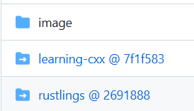
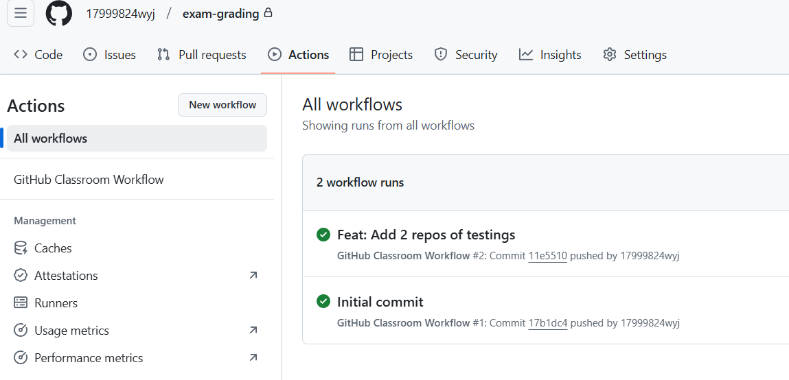
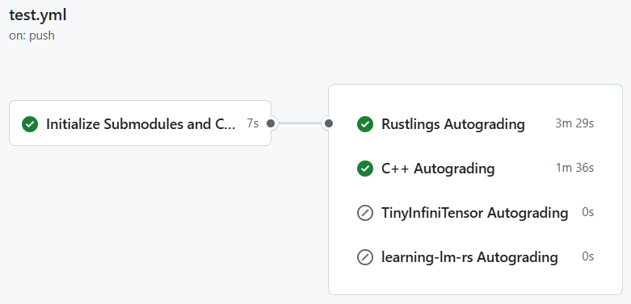

# Q & A

## 目录

- [Q \& A](#q--a)
  - [目录](#目录)
  - [1. Cpp 第 30 题](#1-cpp-第-30-题)
  - [2. 为什么本地测试过了，提交后榜单上还是没有我？](#2-为什么本地测试过了提交后榜单上还是没有我)

## 1. Cpp 第 30 题

有同学提到，Cpp 的析构顺序与平台是相关的，具体情况如下：

在 windows 里(MSVC)：

<image src="../resources/win-析构.png" style="display: inline-block;" width=60%>

在 kali 里(gcc)：

<image src="../resources/kali-析构.png" style="display: inline-block;" width=60%>

可以看到，虽然代码一样，但析构顺序是不同的。此问题的解决方法是，请确保析构顺序是确定的，即以 CI 中的 gcc 顺序为标准。

## 2. 为什么本地测试过了，提交后榜单上还是没有我？

这个情况非常常见...，但根据经验，只有极小部分是由于训练营的后端出现了问题，更大可能是你的操作出现了问题，大致排查的流程如下：

1. 本地测试过了，提交也过了，但，**你真的提交成功了吗**？
   1. 首先你需要确定，你的提交**真的**成功了，确定方法是，进入 github 内，到**你的**那个`exam-grading`仓库里，看看是否出现了你提交的代码(不管是子模块还是目录，都必然应该有)，如下图，蓝色的是子模块提交上来的，黑色的是目录，你需要点进去看看你的代码是否在里面
      
   2. 在确定你写的代码在里面之后，你需要先去看看，是不是远程运行测试过程中出现了问题。操作流程是，在进入到 github 里的，**你的**那个`exam-grading`后，点击上面的 Actions，看 workflow 的状态。如果报红，那就说明，可能是测试本身出了问题，这时候请去群里问助教。如果是绿色的，请继续排查。下图是**绿色的**示例：
      
   3. 点进去最上面的那个绿色的 workflow，先看到的应该类似下面的图，绿色的代表被执行了，灰色的代表被跳过了，下图中展示的是导学阶段的两个测试被成功执行，专业阶段的被跳过了，**被跳过的原因是**，**命名不对**。
      
   4. 如果上面这些也都正常了，那么，恭喜你，你的提交应该已经成功了，那么就需要继续排查了...
2. 提交成功后没有出现名字的，大致是下面三种情况：
   1. 最常见的是，你没有在训练营里绑定你的 GithubName，[绑定教程点这里](../ch2-04.md#5-添加自己的-githubname)，**必须**保证，先绑定了，再进行测试，如果已经测试完了才绑定，那就需要重新测试，方法是，`rerun action`，具体操作自行百度
   2. 另一种情况是，你的`exam-grading`版本过老，需要更新，更新时，最小量操作的方法是改一下`你的exam-grading/.github/workflow/test.yml`，把它从官方模板里复制一份贴进去，然后重新 push 一份代码跑测试
3. 还有可能是其它种种情况，如遇此，请去群里问助教
